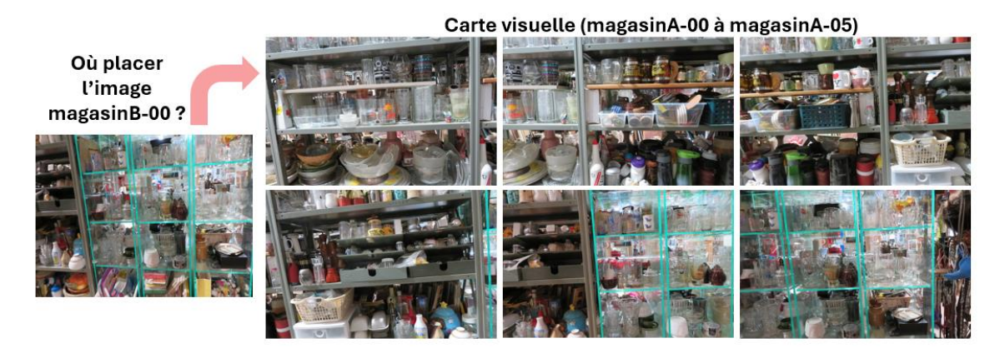

# Localisation automatique par carte visuelle
Projet réalisé dans le cadre du cours **SYS809 - Vision par ordinateur** (ÉTS, Montréal).  

   

## Objectif

Ce projet vise à estimer la position d’une image prise dans une scène, en la comparant à une séquence d’images de référence
L’idée est de déterminer, pour une image donnée de la séquence *B*, quelle image correspondante de la séquence *A* représente la même scène.

   

L'objectif est donc de développer, d'implémenter et de comparer plusieurs méthodes de correspondance d’images afin d’évaluer leur efficacité en contexte de localisation.

## Pipeline de traitement

1. Chargement des séquences A et B  
2. Extraction des points-clés et descripteurs  
3. Matching entre chaque image de A et B  
4. Sélection de la meilleure correspondance  
5. Calcul de l’erreur de localisation (|i − j|)  
6. Sauvegarde et visualisation des résultats (CSV, PNG, TXT)

## Jeux de données

Les méthodes ont été évaluées sur des séquences d’images variées afin de tester leur robustesse dans différents contextes visuels :

| Séquence | Description |
|-----------|-------------|
| **neige** | Scène extérieure lumineuse et peu contrastée |
| **studio** | Scène simple, faible luminosité |
| **visages** | Portraits humains variés |
| **parc** | Environnement naturel semi-structuré |
| **magasin** | Intérieur complexe avec motifs répétitifs |
| **cerveau** | IRM du cerveau, complexe, faible contraste et symétrie |
| **légumes** | Objets colorés et bien structurés |

## Méthodes testées

Quatre approches ont été implémentées et comparées :

| Méthode | Type | Description |
|----------|------|-------------|
| **SIFT + BFMatcher** | Classique | Basé sur les gradients et la distance euclidienne |
| **SIFT + FLANN** | Classique (optimisée) | Approximation des plus proches voisins (KD-Tree) |
| **ORB (Oriented FAST and Rotated BRIEF)** | Rapide | Descripteurs binaires, distance de Hamming |
| **SuperPoint + LightGlue** | Profonde | Réseau convolutionnel avec attention croisée |

*SuperPoint + LightGlue* donne la meilleure précision, tandis qu’*ORB* est la plus rapide.

   

